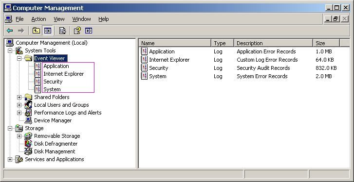

# Managing the Windows Event Log

## Overview

This class offers methods useful to read from and write to the Windows Event Log.

The Windows Event Log is important to many large organisation due to the fact that servers situated in a special room cannot be accessed easily, not even by an administrator, and that monitoring them has therefore to be done remotely. 

The Windows Event Log _can_ be easily monitored remotely and is therefore the ideal place to report "Start", "Stop", "Fatal Error", Security problems and more.

## Windows Event Log Classes

There are a number of so-called "Logs" available in the Windows Event Log:

There might be others as well. It is possible to create your own Log.

While security is reserved for Microsoft "System" should be use by drivers etc. "Application" is the natural choice for an APL program, although you might want to create your own log.

## Source

Note that within a class you must specify a source, normally your application name. Note further that the name of the source must be unique **across all logs**, not only the log you try to write to!

## .NET

The '''WindowsEventLog''' class uses .NET but tries to hide everything not needed by an APL application programmer, or to use appropriate defaults.

## Security

Using this class without admin rights, for example when your application runs as a service, needs "EventLogPermission" rights. On a server were you cannot control this it might be a problem. Microsoft explicitly points out that granting this right is a security risk and should therefore only be given to code that is fully managed (trusted).

Normally you get around this by establishing the Source (and possibly also the Log if it is a custom log) in an installer which needs elevated rights anyway.